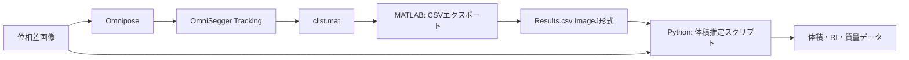

# OmniSegger Long/Short Axis → QPI体積推定ワークフロー

## 結論：体積推定は可能です！

**Yes！** OmniSeggerのlong/short axis情報を使って、提示されたPythonスクリプトと同じ方法で体積推定ができます。

## データの互換性

### OmniSeggerが持つ情報

[`trackOptiMakeCell.m`](omnisegger/SuperSegger-master/cell/trackOptiMakeCell.m)で生成される`data.CellA`構造体：

```matlab
data.CellA{i}.coord.r_center  % セル中心座標 [X, Y]
data.CellA{i}.coord.e1        % Long axis 単位ベクトル
data.CellA{i}.coord.e2        % Short axis 単位ベクトル
data.CellA{i}.length          % [長軸長, 短軸長] (pixels)
data.CellA{i}.coord.orientation % 角度（度）
```


### Pythonスクリプトが必要とする情報

```python
roi_params = {
    'X': center_x,       # ← data.CellA{i}.coord.r_center(1)
    'Y': center_y,       # ← data.CellA{i}.coord.r_center(2)
    'Major': length,     # ← data.CellA{i}.length(1)
    'Minor': width,      # ← data.CellA{i}.length(2)
    'Angle': angle       # ← data.CellA{i}.coord.orientation
}
```

**完全に互換性があります！**

## 実装アプローチ

### ステップ1: MATLABでCSVエクスポート関数を作成

新しいMATLABスクリプト `export_clist_to_imagej_csv.m` を作成：

```matlab
function export_clist_to_imagej_csv(clist_path, output_csv_path)
    % OmniSeggerのclist.matをImageJ Results.csv形式に変換
    
    load(clist_path);  % clistを読み込み
    
    % 各セルの各フレームについて情報を抽出
    results = [];
    
    for cell_id = 1:length(clist)
        cell = clist{cell_id};
        if isempty(cell), continue; end
        
        % 各フレームのデータを抽出
        for frame_idx = 1:length(cell.data)
            data_frame = cell.data{frame_idx};
            if isempty(data_frame), continue; end
            
            % ImageJ形式に変換
            row = struct();
            row.Slice = cell.birthF + frame_idx - 1;  % フレーム番号
            row.X = data_frame.coord.r_center(1);
            row.Y = data_frame.coord.r_center(2);
            row.Major = data_frame.length(1);
            row.Minor = data_frame.length(2);
            row.Angle = data_frame.coord.orientation;
            row.Label = sprintf('output_phase%04d', row.Slice);
            
            results = [results; row];
        end
    end
    
    % CSV保存
    T = struct2table(results);
    writetable(T, output_csv_path);
end
```


### ステップ2: Pythonスクリプトで処理

既存のPythonスクリプトをそのまま使用：

```bash
python your_script.py
```

パラメータ設定：

- `RESULTS_CSV`: エクスポートしたCSVファイルのパス
- `IMAGE_DIRECTORY`: 元の位相差画像のディレクトリ
- `PIXEL_SIZE_UM`: OmniSeggerと同じピクセルサイズ

## データフロー図




## 実装内容

### 作成するファイル

1. **`export_clist_to_imagej_csv.m`**

- clist.matからImageJ Results.csv形式に変換
- 各セルの各フレームについてMajor/Minor/Angle等を抽出
- Sliceカラムでフレーム番号を保持

2. **`VOLUME_ESTIMATION_GUIDE.md`**

- 完全なワークフロー手順書
- パラメータ設定ガイド
- トラブルシューティング

3. **`run_volume_estimation.m`** (統合スクリプト)

- ワンクリックで全ステップを実行
- Tracking → CSVエクスポート → Pythonスクリプト起動

### データ構造の対応

| OmniSegger | ImageJ Results.csv | Python変数 ||------------|-------------------|------------|| `coord.r_center(1)` | X | roi_params['X'] || `coord.r_center(2)` | Y | roi_params['Y'] || `length(1)` | Major | roi_params['Major'] || `length(2)` | Minor | roi_params['Minor'] || `coord.orientation` | Angle | roi_params['Angle'] || `birthF + frame_idx` | Slice | frame_number |

## 体積推定の原理

Pythonスクリプトは以下を実装：

1. **ロッド形状モデル**

- 楕円パラメータ（Major/Minor/Angle）からロッド形状（円柱+半球）を仮定
- 各ピクセルでZ方向の厚みを計算

2. **サブピクセルサンプリング**

- マスク境界での精度向上（5×5または10×10）

3. **位相差 → 屈折率変換**

- φ = (2π/λ) × (n_sample - n_medium) × thickness
- n_sample = n_medium + (φ × λ) / (2π × thickness)

4. **体積計算**

- Volume [µm³] = Σ(各ピクセルの厚み[µm] × ピクセル面積[µm²])

5. **質量計算**

- Concentration [mg/ml] = (RI - RI_medium) / α
- Total mass [pg] = Σ(concentration × pixel_volume)

## 使用方法

### クイックスタート

```matlab
% MATLABで実行
cd('C:\Users\QPI\Documents\Omnisegger\omnisegger');

% ステップ1: Trackingが完了していることを確認
% (setup_tracking を既に実行済み)

% ステップ2: CSVエクスポート
clist_path = 'data\subtracted\xy1\clist.mat';
output_csv = 'data\subtracted\xy1\Results_omnisegger.csv';
export_clist_to_imagej_csv(clist_path, output_csv);

% ステップ3: Pythonスクリプトを実行
% (別ターミナルで)
% python your_volume_script.py
```


### Pythonスクリプトのパラメータ設定

```python
# パス設定
RESULTS_CSV = r"C:\...\xy1\Results_omnisegger.csv"
IMAGE_DIRECTORY = r"C:\...\data\subtracted"

# QPI実験パラメータ（OmniSeggerと同じ値を使用）
PIXEL_SIZE_UM = 0.108  # または 0.348（画像の解像度による）
WAVELENGTH_NM = 663
N_MEDIUM = 1.333
ALPHA_RI = 0.0018

# 形状パラメータ
SHAPE_TYPE = 'ellipse'  # OmniSeggerはellipseと互換
SUBPIXEL_SAMPLING = 5
```


## 注意事項

### ピクセルサイズの確認

OmniSeggerで使用した画像と同じピクセルサイズを使用してください：

```matlab
% processExp.m で設定した値
CONST.res  % μm/pixel
```


### 座標系の違い

- **OmniSegger**: MATLAB座標系（1-indexed）
- **ImageJ/Python**: 0-indexed or 1-indexed（確認が必要）

→ エクスポート関数で自動調整します

### フレーム番号の対応

- `Slice`カラムでフレーム番号を保持
- 画像ファイル名（例：`output_phase0001.tif`）と自動マッチング

## 期待される出力

### Pythonスクリプトの出力

```javascript
timeseries_density_output_ellipse_subpixel5/
├── density_tiff/
│   ├── ROI_0001_Frame_0001_ri.tif          # 屈折率マップ
│   ├── ROI_0001_Frame_0001_concentration.tif # 質量濃度マップ
│   ├── ROI_0001_Frame_0001_zstack.tif      # 厚みマップ
│   └── ...
├── visualizations/
│   └── ROI_0001_Frame_0001_visualization.png
├── csv_data/
│   ├── ROI_0001_Frame_0001_pixel_data.csv
│   └── ROI_0001_Frame_0001_parameters.csv
└── all_rois_summary.csv  # 全ROIの統計データ
```


### サマリーCSVの内容

```javascript
frame_number, volume_um3, total_mass_pg, ri_mean, concentration_mean, ...
1, 15.234, 123.45, 1.3456, 245.67, ...
2, 16.123, 134.56, 1.3467, 256.78, ...
...
```


## トラブルシューティング

### 問題1: フレーム番号が一致しない

**症状**: "Frame X not found in image files"**解決策**:

- 画像ファイル名を確認（例：`output_phase0001.tif`）
- CSVの`Label`カラムとファイル名パターンが一致するか確認

### 問題2: 座標がずれている

**症状**: ROIが画像上の違う場所を指している**解決策**:

- ピクセルサイズが正しいか確認
- 座標系の変換が必要か確認（1-indexed vs 0-indexed）

### 問題3: clist.matが見つからない

**症状**: "Cannot find clist.mat"**解決策**:

```matlab
% Trackingを先に実行
setup_tracking
% または
processExp('data\subtracted', 1, 0, 1);
```


## 主要なファイル

- OmniSegger tracking: [`trackOptiMakeCell.m`](omnisegger/SuperSegger-master/cell/trackOptiMakeCell.m)
- セル幾何学計算: [`toMakeCell.m`](omnisegger/SuperSegger-master/cell/toMakeCell.m)