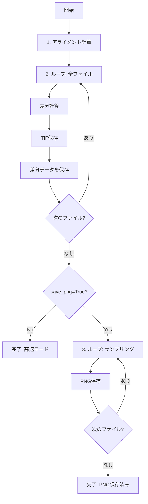

# PNG保存をオプション化する計画

## 変更概要

[`21_calc_alignment.py`](c:\Users\QPI\Documents\QPI_omni\scripts\21_calc_alignment.py)の処理フローを変更し、TIF保存完了後にPNG保存を行うように分離します。

## 現状の問題

現在は288-312行のループ内で以下が同時実行されています：

- 差分計算
- TIF保存（軽い）
- PNG保存（重い）

これにより、3168ファイル全てに対してPNG保存が強制実行され、処理に数時間かかります。

## 実装内容

### 1. 関数シグネチャの変更

`step1_calculate_and_subtract_fixed()`に新しいパラメータを追加：

- `save_png`: bool, default=False - PNG保存するかどうか
- `png_dpi`: int, default=150 - PNG解像度（300は重い）
- `png_sample_interval`: int, default=1 - N枚ごとにPNG保存（1=全部、10=10枚に1枚）

### 2. 処理の分離

#### フェーズ1: 差分計算 + TIF保存（288-312行を修正）

```python
# 差分データを保存するリストを追加
subtracted_images = []

for idx, img_data in enumerate(aligned_images):
    # 差分計算
    subtracted = aligned_img - reference_aligned
    
    # 差分TIF保存
    io.imsave(subtracted_path, subtracted.astype(np.float32))
    
    # PNG用にデータを保存
    subtracted_images.append({
        'subtracted': subtracted,
        'base_name': base_name
    })
```


#### フェーズ2: PNG保存（新しいループを追加）

```python
# PNG保存（オプション）
if save_png:
    print(f"\n[5] カラーマップPNG保存中...")
    for idx, data in enumerate(subtracted_images):
        if idx % png_sample_interval == 0:
            # PNG保存処理
            plt.savefig(..., dpi=png_dpi)
```


### 3. メイン実行部の更新

デフォルト値を設定：

```python
save_png=False,  # デフォルトでスキップ（高速）
png_dpi=150,     # 150で十分（300は重い）
png_sample_interval=1  # 全保存
```


## 処理フロー




## 実行例

### 高速モード（推奨）

```python
save_png=False  # PNG不要 → 数分で完了
```


### 確認用（10枚に1枚保存）

```python
save_png=True, png_sample_interval=10  # → 数十分
```


### 全保存（時間かかる）

```python
save_png=True, png_dpi=150, png_sample_interval=1  # → 数時間
```


## メリット

1. TIF保存は常に高速完了（数分）
2. PNG保存は必要な時だけ実行
3. サンプリング機能で確認用に一部だけ保存可能