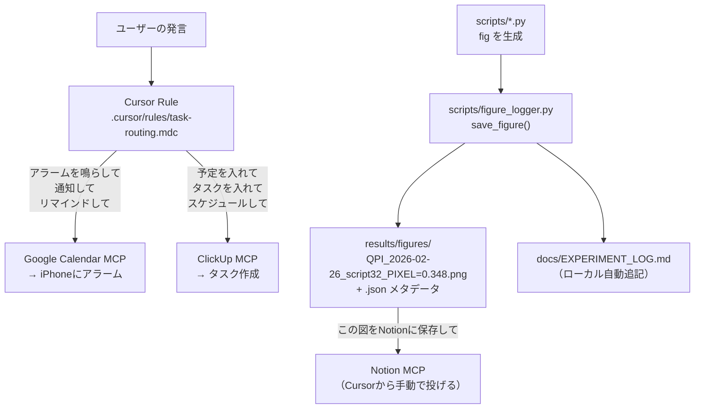

# Research Automation System

## 全体構成




## 作成するファイル

### 1. `.cursor/rules/task-routing.mdc`

Google CalendarとClickUpの使い分けルール。以下のパターンで判定する。

- **Google Calendar** : 「アラームを鳴らして」「通知して」「リマインドして」「◯時に知らせて」
- **ClickUp** : 「予定を入れて」「タスクを入れて」「スケジュールして」「ToDo」
- **デフォルト** : 予定系の言葉があればClickUp。アラーム系の言葉があればGoogle Calendar。

### 2. `.cursor/mcp.json`

ClickUp MCP・Google Calendar MCP・Notion MCPをCursorに追加。

```json
{
  "mcpServers": {
    "clickup": {
      "command": "npx",
      "args": ["-y", "@modelcontextprotocol/server-clickup"],
      "env": { "CLICKUP_API_TOKEN": "YOUR_TOKEN_HERE" }
    },
    "notion": {
      "command": "npx",
      "args": ["-y", "@modelcontextprotocol/server-notion"],
      "env": { "NOTION_API_TOKEN": "YOUR_TOKEN_HERE" }
    }
  }
}
```

### 3. `scripts/figure_logger.py`

既存の `plt.savefig()` を置き換えるユーティリティ。

**使い方（既存スクリプトの変更例）**

変更前（例: `scripts/32_simple_ellipse_ri.py`）:

```python
plt.savefig("simple_mean_ri.png", dpi=150)
```

変更後:

```python
from figure_logger import save_figure
save_figure(fig, params={
    "pixel_size_um": PIXEL_SIZE_UM,
    "wavelength_nm": WAVELENGTH_NM,
    "n_medium": N_MEDIUM,
}, description="mean RI計算: ellipse体積でtotal phaseを割った結果")
```

自動生成されるファイル名例:

```
results/figures/QPI_2026-02-26_32_simple_ellipse_ri_PIXEL=0.348_WL=663_N=1.333.png
results/figures/QPI_2026-02-26_32_simple_ellipse_ri_PIXEL=0.348_WL=663_N=1.333.json
```

`docs/EXPERIMENT_LOG.md` への自動追記フォーマット:

```markdown
## 2026-02-26 | 32_simple_ellipse_ri
**説明**: mean RI計算: ellipse体積でtotal phaseを割った結果
**パラメータ**: pixel_size_um=0.348, wavelength_nm=663, n_medium=1.333
**図ファイル**: results/figures/QPI_2026-02-26_32_simple_ellipse_ri_...png
```

## 必要な準備（ユーザー側）

- ClickUp APIトークン: ClickUp → Settings → Apps → API Token
- Notion Integration Token: [notion.so/my-integrations](https://www.notion.so/my-integrations) で作成 + 対象データベースにIntegrationを追加
- Node.js がインストール済みであること（MCP用）

