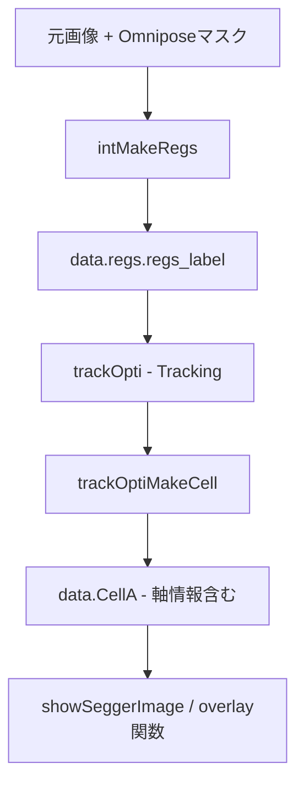

# OmniSegger Visualization機能の詳細解説

## 調査結果サマリー

### できること

1. **セルアウトラインのoverlay** (複数の描画方法あり)
   - [`doDrawCellOutline.m`](omnisegger/SuperSegger-master/viz/doDrawCellOutline.m): 基本的なアウトライン
   - [`doDrawCellOutlineSMM.m`](omnisegger/SuperSegger-master/viz/doDrawCellOutlineSMM.m): スムーズなスプライン
   - [`doDrawCellOutlinePAW.m`](omnisegger/SuperSegger-master/viz/doDrawCellOutlinePAW.m): PAWバージョン
   - [`drawCellSpline.m`](omnisegger/SuperSegger-master/viz/drawCellSpline.m): 出版品質のスプライン

2. **Pole（極）の表示**
   - Old pole（古い極）とNew pole（新しい極）を区別
   - 娘細胞間の接続線を表示

3. **Long/Short Axisについて**
   - **Long axis (e1)**: セルの長軸方向のベクトル
   - **Short axis (e2)**: セルの短軸方向のベクトル
   - これらの座標は [`showSeggerImage.m`](omnisegger/SuperSegger-master/viz/showSeggerImage.m) の `intPlotPole` 関数内で計算されている（919-922行目）:

```matlab
xaxisx = r(1) + [0,tmp.length(1)*tmp.coord.e1(1)]/2;
xaxisy = r(2) + [0,tmp.length(1)*tmp.coord.e1(2)]/2;
yaxisx = r(1) + [0,tmp.length(2)*tmp.coord.e2(1)]/2;
yaxisy = r(2) + [0,tmp.length(2)*tmp.coord.e2(2)]/2;
```

   - **現状の制限**: 軸の座標は計算されているが、デフォルトでは描画されていない
   - **解決策**: これらの座標を使って `plot` コマンドを追加すれば表示可能

4. **その他の可視化機能**
   - キモグラフ作成
   - 系譜図（Lineage tree）
   - セルID/リージョン番号の表示
   - 蛍光チャンネルとのoverlayが可能

### Long/Short Axisのoverlayは可能か？

**Yes！可能です。** ただし、現在の実装では自動的には描画されません。

2つの方法があります：

**方法1: カスタム関数を作成**
- `intPlotPole` 関数を修正または拡張して、軸を描画

**方法2: 手動でplot**
- err.matファイルを読み込んで、`data.CellA{i}.coord` から軸情報を取得し、手動で描画

### 必要な入力データ

#### 最小限の必須データ（アウトライン表示のみ）

```matlab
data.phase              % 位相画像（元画像）
data.regs.regs_label   % ラベル付きマスク（Omniposeから）
data.regs.props        % regionpropsの結果
data.regs.ID           % セルID（オプション）
```

#### Long/Short Axis表示に必要なデータ

```matlab
data.CellA{i}.coord.r_center  % セルの中心座標
data.CellA{i}.coord.e1        % Long axis の単位ベクトル
data.CellA{i}.coord.e2        % Short axis の単位ベクトル
data.CellA{i}.length          % [長さ, 幅]
data.CellA{i}.pole            % Pole情報（極の向き）
```

#### Fluorescence overlayに必要なデータ（オプション）

```matlab
data.fluor1  % 蛍光チャンネル1
data.fluor2  % 蛍光チャンネル2（オプション）
```

### データ生成の流れ



1. **Omniposeマスク** → `data.regs.regs_label` に変換
2. **Tracking実行** → セルIDを割り当て
3. **trackOptiMakeCell** → `data.CellA` を生成（軸情報を含む）
4. **Visualization関数** → overlayを作成

### あなたのケース

**持っているもの:**
- 元画像（2,824フレーム）✓
- Omniposeマスク（2,575フレーム）✓

**必要なステップ:**
1. `setup_tracking` でTrackingを実行 → err.matファイルを生成
2. err.matには `data.CellA` が含まれ、Long/Short Axis情報が利用可能
3. カスタム可視化スクリプトを作成してoverlayを描画

## 提案する対応

### ドキュメント作成

新しいマークダウンファイル `VISUALIZATION_OVERLAY_GUIDE.md` を作成し、以下を含める：

1. Visualization機能の完全リスト
2. Long/Short Axisのoverlay方法（コード例付き）
3. 必要なデータ構造の詳細説明
4. サンプルスクリプト

### サンプルスクリプト作成

`visualize_cell_axes.m` を作成：
- err.matファイルを読み込み
- 位相画像上にセルアウトラインをoverlayし
- Long axis（長軸）とShort axis（短軸）を描画
- Poleをマーク

このスクリプトで、ユーザーは簡単にセルの軸を可視化できます。

### 主要なファイル

- [`showSeggerImage.m`](omnisegger/SuperSegger-master/viz/showSeggerImage.m) - メイン可視化関数
- [`trackOptiMakeCell.m`](omnisegger/SuperSegger-master/cell/trackOptiMakeCell.m) - CellA構造体を生成
- [`toMakeCell.m`](omnisegger/SuperSegger-master/cell/toMakeCell.m) - 軸の座標を計算