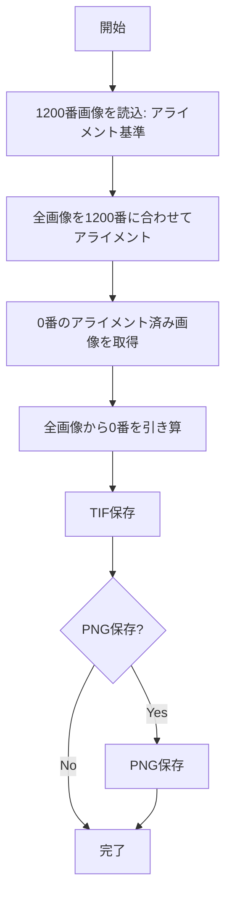

# アライメント基準と引き算基準を分離する計画

## 変更概要

[`21_calc_alignment.py`](c:\Users\QPI\Documents\QPI_omni\scripts\21_calc_alignment.py)を修正し、アライメント計算の基準画像（1200番）と引き算の基準画像（0番）を別々に指定できるようにします。

## 現状の問題

現在の`reference_index`パラメータは：
- アライメント計算の基準
- 引き算の基準

両方に使用されており、別々の画像を指定できません。

## 実装内容

### 1. 関数パラメータの変更 (70-87行)

`reference_index`を2つに分離：

```python
def step1_calculate_and_subtract_fixed(
    empty_channel_folder, output_folder, output_json,
    alignment_reference_index=1200,  # アライメント基準
    subtraction_reference_index=0,   # 引き算基準
    method='ecc',
    ...
)
```

### 2. 基準画像の読み込み (108-120行)

両方の基準画像を読み込む：
- `alignment_reference_img`: アライメント計算用（1200番）
- `subtraction_reference_img`: 引き算用（0番、アライメント済み）

### 3. アライメント計算ループ (128-234行)

`alignment_reference_index`を使用してアライメント計算

### 4. 差分計算ループ (292-318行)

`subtraction_reference_index`のアライメント済み画像を使用して引き算

### 5. JSON保存 (243-256行)

両方のインデックスを保存：
```python
{
    'alignment_reference_index': 1200,
    'alignment_reference_filename': '...',
    'subtraction_reference_index': 0,
    'subtraction_reference_filename': '...',
    ...
}
```

### 6. メイン実行部 (376-388行)

両方の値を設定：
```python
alignment_reference_index=1200,   # アライメント基準
subtraction_reference_index=0,    # 引き算基準
```

## 処理フロー



## 実行例

```python
# 1200番でアライメント、0番で引き算
alignment_reference_index=1200,
subtraction_reference_index=0,
```

## メリット

1. アライメント基準と引き算基準を独立して指定可能
2. 中間フレーム（1200番）でアライメント → ドリフト補正に有効
3. 最初のフレーム（0番）で引き算 → バックグラウンド除去に有効
