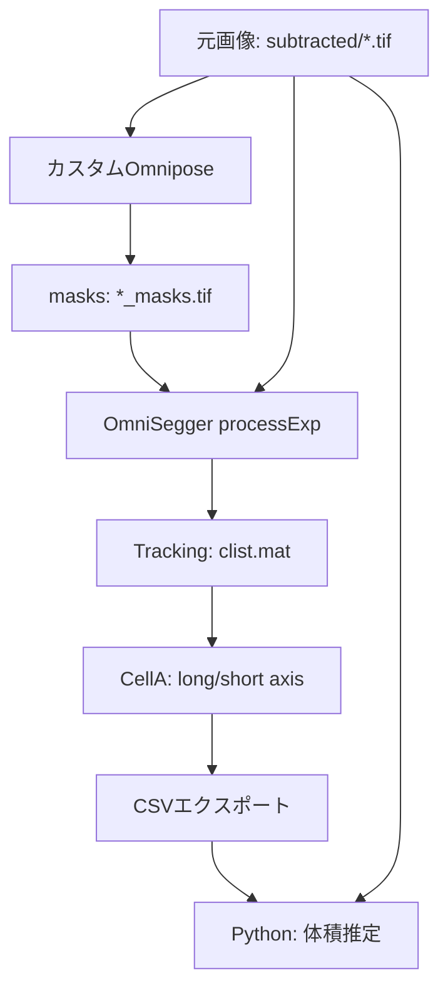

# カスタムOmnipose → OmniSegger → 体積推定ワークフロー

## 結論：可能です！

**Yes！** カスタムOmniposeモデルのマスクとflowがあれば、OmniSeggerでtrackingとlong/short axis取得が可能です。

## 必要なデータ

### 現在持っているもの（ユーザーの状況）

```
subtracted/
├── output_phase0001_bg_corr_subtracted.tif  # 元画像
├── output_phase0002_bg_corr_subtracted.tif
├── ...
└── inference_out/
    ├── output_phase0001_bg_corr_subtracted_masks.tif   # マスク（uint16）
    ├── output_phase0001_bg_corr_subtracted_binary.tif  # 輪郭（uint8）
    └── ...
```

### OmniSeggerが必要とするもの

1. **マスク画像** (`*_masks.tif`) ✓ あります
2. **元の位相差画像** ✓ あります
3. **Flow情報** (オプション、なくてもtracking可能)

**重要**: Flowは必須ではありません！マスクだけでもtrackingできます。

## データフロー



## OmniSeggerでのカスタムマスク使用方法

### ステップ1: ファイル名をOmniSegger形式に変換

現在のファイル名：
```
output_phase0001_bg_corr_subtracted.tif
```

OmniSegger形式（必要）：
```
subtracted_t001xy1c1.tif
```

MATLABスクリプト `convert_filenames_for_omnisegger.m` を作成：

```matlab
function convert_filenames_for_omnisegger(data_dir)
    % カスタムOmniposeの出力をOmniSegger形式にリネーム
    
    % 元画像のリネーム
    files = dir(fullfile(data_dir, 'output_phase*.tif'));
    
    for i = 1:length(files)
        old_name = files(i).name;
        
        % フレーム番号を抽出
        match = regexp(old_name, 'output_phase(\d+)', 'tokens');
        if ~isempty(match)
            frame_num = str2double(match{1}{1});
            
            % 新しい名前
            new_name = sprintf('subtracted_t%03dxy1c1.tif', frame_num);
            
            % リネーム
            old_path = fullfile(data_dir, old_name);
            new_path = fullfile(data_dir, new_name);
            movefile(old_path, new_path);
            
            fprintf('Renamed: %s -> %s\n', old_name, new_name);
        end
    end
    
    % マスクファイルも同様にリネーム
    mask_dir = fullfile(data_dir, 'inference_out');
    if exist(mask_dir, 'dir')
        mask_files = dir(fullfile(mask_dir, '*_masks.tif'));
        
        for i = 1:length(mask_files)
            old_name = mask_files(i).name;
            
            match = regexp(old_name, 'output_phase(\d+)', 'tokens');
            if ~isempty(match)
                frame_num = str2double(match{1}{1});
                new_name = sprintf('subtracted_t%03dxy1c1_masks.tif', frame_num);
                
                old_path = fullfile(mask_dir, old_name);
                new_path = fullfile(mask_dir, new_name);
                movefile(old_path, new_path);
            end
        end
    end
    
    disp('File renaming completed!');
end
```

### ステップ2: processExpを修正してカスタムマスクを使用

`processExp.m` を編集して、既存のマスクを使用するように設定：

```matlab
% processExp.m の該当部分を修正

%% カスタムマスクの使用設定
CONST.use_custom_masks = true;  % カスタムマスクを使用
CONST.custom_mask_dir = 'inference_out';  % マスクのサブディレクトリ

%% ファイル名変換はスキップ（既に変換済み）
% convertImageNames の呼び出しをコメントアウト
```

### ステップ3: OmniSeggerの内部処理を確認

[`intMakeRegs.m`](omnisegger/SuperSegger-master/trainingConstants/intMakeRegs.m) を確認すると、既にOmniposeマスクを直接読み込む機能があります：

```matlab
% Line 41-43
labeledmask = double(imread(maskpath)); % Omniposeマスクを読み込み
ss = size(labeledmask);
data.regs.regs_label = labeledmask; % regs_labelに設定
```

これは**任意のOmniposeモデル**（カスタムモデル含む）のマスクに対応しています！

## Long/Short Axis取得の仕組み

### データ生成プロセス

1. **Tracking**: `processExp` → `trackOpti` → フレーム間でセルをリンク
2. **CellA生成**: `trackOptiMakeCell` → 各セルの幾何学情報を計算
3. **Long/Short Axis計算**: `toMakeCell` → 主軸を計算

### Long/Short Axisの計算方法

[`toMakeCell.m`](omnisegger/SuperSegger-master/cell/toMakeCell.m) (68-94行目):

```matlab
% 主軸と副軸
e1 = [cos(theta); sin(theta)];  % Long axis (major)
e2 = [-sin(theta); cos(theta)]; % Short axis (minor)

% 長さを計算
len = [sum(double(xind)), sum(double(yind))];  % [長軸長, 短軸長]

% 座標を保存
celld.coord.e1 = e1;           % Long axis 単位ベクトル
celld.coord.e2 = e2;           % Short axis 単位ベクトル  
celld.length = len;            % [長軸長, 短軸長]
celld.coord.orientation = -props.Orientation;  % 角度
```

**重要ポイント**:
- マスクの形状（`regionprops`の`Orientation`）から計算
- Omniposeモデルの種類は関係ない
- **マスクさえあれば計算可能**

## 完全なワークフロー

### 準備フェーズ

```matlab
% 1. MATLABを起動
cd('C:\Users\QPI\Desktop\align_demo\from_outputphase\bg_corr\subtracted');

% 2. OmniSeggerパスを追加
addpath(genpath('C:\Users\QPI\Documents\Omnisegger\omnisegger'));
savepath;

% 3. ファイル名を変換
convert_filenames_for_omnisegger(pwd);
```

### Tracking実行

```matlab
% 4. Trackingを実行
processExp(pwd, 1, 0, 1);

% 注意: Omniposeステップでは、既存マスクを使用するよう設定
% processExp.m内で CONST.use_custom_masks = true を設定済み
```

処理中に以下が生成されます：

```
subtracted/xy1/
├── seg/
│   ├── *err.mat         # 各フレームのセグメント情報
│   └── ...
├── cell/                # 個別セル情報
├── clist.mat           # ★ Tracking結果（long/short axis含む）
└── clist.xlsx          # Excel版
```

### Long/Short Axis確認

```matlab
% 5. clistを読み込んで確認
load('xy1/clist.mat');

% セル1の情報を表示
cell_1 = clist{1};
disp('Cell 1 information:');
disp(cell_1.data{1}.coord);  % 座標情報
disp(cell_1.data{1}.length); % [長軸, 短軸]

% Long axis ベクトル
e1 = cell_1.data{1}.coord.e1;
fprintf('Long axis: [%.4f, %.4f]\n', e1(1), e1(2));

% Short axis ベクトル
e2 = cell_1.data{1}.coord.e2;
fprintf('Short axis: [%.4f, %.4f]\n', e2(1), e2(2));
```

### CSVエクスポート（体積推定用）

```matlab
% 6. ImageJ形式にエクスポート
export_clist_to_imagej_csv('xy1/clist.mat', 'xy1/Results_omnisegger.csv');
```

### Python体積推定

```bash
# 7. Pythonスクリプトで体積推定
python your_volume_estimation_script.py
```

## Flow情報について

### Flowは必要？

**いいえ、必須ではありません。**

- OmniSeggerのtrackingは主に**マスクの重なり**でセルをリンク
- Flowは補助情報として使用可能だが、なくても動作します

### Flowを使用する場合

カスタムOmniposeの出力に`*_flows.tif`があれば、それを利用できます。

現在のコードでは保存していないようなので、必要な場合は：

```python
# セグメンテーションコードに追加
io.save_masks(
    images=images,
    masks=masks,
    flows=flows,  # ★ これが重要
    file_names=image_files,
    tif=True,
    save_flows=True,  # ★ Flowを保存
    savedir=outdir,
    omni=True
)
```

## トラブルシューティング

### 問題1: "No Omnipose masks found"

**原因**: マスクファイルのパスが認識されない

**解決策**:
```matlab
% processExp.m で明示的に指定
CONST.mask_path = fullfile(pwd, 'inference_out');
```

### 問題2: ファイル名が認識されない

**原因**: OmniSegger命名規則に従っていない

**解決策**: ステップ1のリネームスクリプトを実行

### 問題3: clist.matにlong/short axisがない

**原因**: `trackOptiMakeCell`が実行されていない

**解決策**:
```matlab
% 手動で実行
CONST = loadConstants('60XEc', false);
trackOptiMakeCell('xy1/seg', CONST, 'Processing');
```

### 問題4: マスクが正しく読み込まれない

**原因**: マスクファイル形式の問題

**確認**:
```matlab
% マスクを読み込んでテスト
mask = imread('inference_out/subtracted_t001xy1c1_masks.tif');
disp(class(mask));  % uint16 であるべき
disp(size(mask));
disp([min(mask(:)), max(mask(:))]);  % ラベル番号の範囲
```

## カスタムモデルの利点

カスタムOmniposeモデルを使用する利点：

1. **特定の細菌種に最適化**
2. **特殊な画像条件に対応**（位相差の強度、ノイズレベルなど）
3. **セグメンテーション精度の向上**

OmniSeggerは**どんなOmniposeモデル**のマスクでも使用可能なので、カスタムモデルとの相性は問題ありません。

## データ要件まとめ

| データ | 必須？ | 用途 | あなたの状況 |
|--------|--------|------|------------|
| 元画像 | ✓ | Tracking、体積推定 | ✓ あり |
| マスク | ✓ | セル検出、形状計算 | ✓ あり |
| Flow | △ | Tracking補助 | × なし（不要） |
| 輪郭 | × | 可視化のみ | ✓ あり |

**結論**: 現在のデータ（元画像 + マスク）だけで、long/short axis取得と体積推定が可能です！

## 実装ファイル

作成するファイル：

1. **`convert_filenames_for_omnisegger.m`**
   - ファイル名をOmniSegger形式に変換
   
2. **`export_clist_to_imagej_csv.m`**
   - clist.matをImageJ Results.csv形式に変換
   
3. **`CUSTOM_OMNIPOSE_WORKFLOW.md`**
   - カスタムモデル使用時の完全手順書
   
4. **`test_custom_mask_loading.m`**
   - マスク読み込みテストスクリプト

## 主要な変更点

processExp.m の修正箇所：

```matlab
%% カスタムマスク使用の設定（追加）
CONST.use_existing_masks = true;
CONST.mask_directory = 'inference_out';
CONST.mask_suffix = '_masks.tif';

%% Omnipose実行をスキップ（マスクが既にあるため）
if CONST.use_existing_masks
    disp('Using existing Omnipose masks from inference_out/');
    % Omniposeステップをスキップ
else
    % 通常のOmnipose実行
end
```

