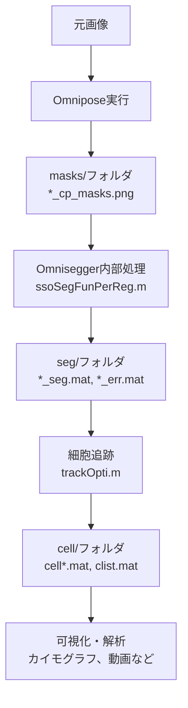

# カスタムマスクでOmnisegger解析を使う完全ガイド

## 前提の整理

### Omniseggerの処理フロー




### 重要な発見

- **セグメンテーションは自由**: 任意のPythonコードでマスクを生成可能
- **形式変換が鍵**: マスクをOmnisegger形式にすれば、後続処理がすべて使える
- **`.mat`ファイルは自動生成**: Omniseggerが内部で作成するため手動作成不要

## 実装内容

### 1. ファイル名・フォルダ構造変換ツール

**新規ファイル**: `omnisegger/prepare_for_omnisegger.py`ユーザーの画像を以下の構造に変換:

```javascript
output_dataset/
└── xy1/
    └── phase/
        ├── basename_t001xy1c1.tif
        ├── basename_t002xy1c1.tif
        └── ...
```

機能:

- 任意の画像ファイルをOmnisegger命名規則に変換
- タイムポイント、xy位置を自動割り当て
- 蛍光画像（c2, c3...）にも対応

### 2. マスク変換ツール

**新規ファイル**: `omnisegger/convert_masks_to_omnisegger.py`ユーザーのPythonスクリプト出力を変換:**入力**（ユーザーの既存出力）:

```javascript
inference_out/
├── image001_masks.tif    # ラベル画像（0=背景、1,2,3...=細胞）
├── image001_binary.tif   # 輪郭画像
├── image002_masks.tif
└── ...
```

**出力**（Omnisegger形式）:

```javascript
output_dataset/
└── xy1/
    └── masks/
        ├── basename_t001xy1c1_cp_masks.png
        ├── basename_t002xy1c1_cp_masks.png
        └── ...
```

変換処理:

- `_masks.tif` を `_cp_masks.png` にリネーム・コピー
- ファイル名をOmnisegger規則に合わせる
- PNG形式（uint16）で保存
- ラベル値の整合性チェック

### 3. 統合ワークフロースクリプト

**新規ファイル**: `omnisegger/custom_segmentation_workflow.py`完全自動化ワークフロー:

```python
# 使用例:
python custom_segmentation_workflow.py \
    --images "F:\251212\ph_1\Pos10\10_7\crop" \
    --output "F:\251212\omnisegger_data" \
    --model "C:\Users\...\omni_model_xxx" \
    --basename "exp251212"
```

処理ステップ:

1. 画像をOmnisegger構造に配置
2. カスタムモデルで推論実行
3. マスクをOmnisegger形式に変換
4. MATLAB実行準備完了を通知

### 4. MATLAB統合スクリプト

**新規ファイル**: `omnisegger/run_omnisegger_analysis.m`Python処理後のMATLAB解析を簡素化:

```matlab
% 使用例:
run_omnisegger_analysis('F:\251212\omnisegger_data', 'exp_settings')

% 実行内容:
% - 細胞追跡（trackOpti）
% - 蛍光解析（オプション）
% - clist生成
% - カイモグラフ作成
% - タイムラプス動画生成
```


### 5. カスタムモデル推論スクリプト（改良版）

**更新ファイル**: ユーザーの既存スクリプトを修正修正点:

- 出力先を `masks/` フォルダに変更
- ファイル名を `*_cp_masks.png` 形式に
- Omnisegger互換の命名規則に対応
```python
# 主な変更:
output_dir = os.path.join(xy_dir, "masks")  # inference_out → masks
mask_name = f"{base_filename}c1_cp_masks.png"  # 命名規則統一
```


### 6. 可視化・解析ヘルパースクリプト

**新規ファイル**: `omnisegger/visualization_helpers.m`よく使う可視化をワンコマンド化:

```matlab
% カイモグラフ作成
create_kymographs_auto('F:\251212\omnisegger_data\xy1')

% タイムラプス動画
create_timelapse_movie('F:\251212\omnisegger_data\xy1')

% 細胞系譜図
plot_cell_lineage('F:\251212\omnisegger_data\xy1')
```


### 7. ドキュメント

**新規ファイル**: `omnisegger/docs/custom_segmentation_guide.md`完全な手順書:

- ステップバイステップの説明
- トラブルシューティング
- 出力ファイルの解説
- 可視化オプション一覧

## 使用方法

### ワークフローA: 統合スクリプト（推奨）

```bash
# 1. Python側で完全自動化
cd C:\Users\QPI\Documents\Omnisegger
python omnisegger/custom_segmentation_workflow.py \
    --images "F:\251212\ph_1\Pos10\10_7\crop" \
    --output "F:\251212\omnisegger_data" \
    --model "C:\Users\QPI\Desktop\archived_train\...\omni_model_xxx" \
    --basename "exp251212" \
    --diameter 30 \
    --flow_threshold 0.11 \
    --mask_threshold 0 \
    --use_gpu

# 出力: 
# - F:\251212\omnisegger_data\xy1\phase\ (画像)
# - F:\251212\omnisegger_data\xy1\masks\ (マスク)
```


```matlab
% 2. MATLABで追跡・解析
cd('C:\Users\QPI\Documents\Omnisegger')
run_omnisegger_analysis('F:\251212\omnisegger_data', '60XEc')

% 3. 可視化
create_kymographs_auto('F:\251212\omnisegger_data\xy1')
```


### ワークフローB: ステップ実行

```bash
# 1. 画像準備
python omnisegger/prepare_for_omnisegger.py \
    --input "F:\251212\ph_1\Pos10\10_7\crop" \
    --output "F:\251212\omnisegger_data" \
    --basename "exp251212"

# 2. 自分のPythonコードで推論
# (既存のスクリプトを使用、出力先を調整)

# 3. マスク変換
python omnisegger/convert_masks_to_omnisegger.py \
    --input_masks "F:\251212\...\inference_out" \
    --output_dir "F:\251212\omnisegger_data\xy1\masks" \
    --basename "exp251212"
```


```matlab
% 4. 通常のOmniseggerワークフロー
processExp('F:\251212\omnisegger_data', 0, 0)
% セグメンテーションはスキップ、追跡から開始
```


### ワークフローC: 既存の推論結果を変換

すでに推論済みの結果がある場合:

```bash
python omnisegger/convert_masks_to_omnisegger.py \
    --input_images "F:\original\images" \
    --input_masks "F:\original\inference_out" \
    --output_dir "F:\omnisegger_ready" \
    --basename "exp"
```


## 対応する機能

変換後、以下のOmnisegger機能がすべて使用可能:✅ **細胞追跡** (trackOpti)✅ **カイモグラフ** (create_kymographs.m)✅ **系譜図** (makeLineage)✅ **タイムラプス動画** (makeCellMovie)✅ **測定値出力** (clist)✅ **蛍光解析** (fluor1/, fluor2/フォルダがあれば)✅ **SuperSeggerViewer** (インタラクティブ可視化)

## 技術的詳細

### マスク形式の要件

- **ピクセル値**: 0=背景、1,2,3...=各細胞のID
- **データ型**: uint8 (細胞数<255) または uint16 (細胞数≥255)
- **形式**: PNG推奨（TIFも可）
- **命名**: `basename_t###xy#c1_cp_masks.png`

### Omniseggerの内部処理

1. `ssoSegFunPerReg.m`: マスクを読み込み、`data.regs.regs_label`に格納
2. `intMakeRegs.m`: マスクから領域（regions）を抽出
3. `trackOpti.m`: 時間方向で細胞をリンク
4. `trackOptiCellFiles.m`: 個別細胞ファイル生成

### `/seg`と`/cell`フォルダの役割

- `/seg`: 各フレームのセグメンテーション結果（.mat形式）
- `*_seg.mat`: 基本データ
- `*_err.mat`: エラー修正後のデータ
- `/cell`: 個別細胞の時系列データ
- `cell###.mat`: 各細胞のライフサイクル
- `clist.mat`: 全細胞の統計表