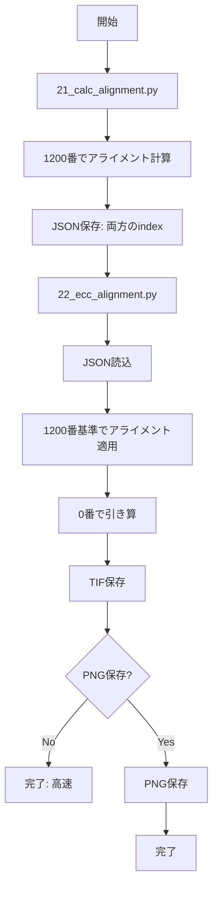

# 21と22のアライメント基準分離 + PNG最適化

## 変更概要

2つのスクリプトを修正：
1. [`21_calc_alignment.py`](c:\Users\QPI\Documents\QPI_omni\scripts\21_calc_alignment.py) - ステップ1（アライメント計算）
2. [`22_ecc_alignment.py`](c:\Users\QPI\Documents\QPI_omni\scripts\22_ecc_alignment.py) - ステップ2（変換適用）

両方で：
- アライメント基準画像（1200番）と引き算基準画像（0番）を分離
- PNG保存をオプション化して高速化

## Part A: 21_calc_alignment.py の修正

### A1. 関数パラメータの変更 (70-87行)

```python
def step1_calculate_and_subtract_fixed(
    empty_channel_folder, output_folder, output_json,
    alignment_reference_index=1200,      # アライメント基準
    subtraction_reference_index=0,       # 引き算基準
    method='ecc',
    vmin=-0.1, vmax=1.7, cmap='RdBu_r',
    save_png=False, png_dpi=150, png_sample_interval=1
)
```

### A2. 基準画像の読み込み (108-120行)

アライメント基準画像を読み込み、後で引き算基準画像のアライメント済みバージョンを使用

### A3. 差分計算の基準変更 (292行付近)

```python
# subtraction_reference_indexのアライメント済み画像を使用
subtraction_reference_aligned = aligned_images[subtraction_reference_index]['aligned_img']
```

### A4. JSON保存の更新 (243-256行)

```python
save_data = {
    'alignment_reference_index': alignment_reference_index,
    'alignment_reference_filename': ...,
    'subtraction_reference_index': subtraction_reference_index,
    'subtraction_reference_filename': ...,
    ...
}
```

### A5. PNG保存の分離

既に実装済み（save_png=Falseでスキップ可能）

## Part B: 22_ecc_alignment.py の修正

### B1. 関数パラメータの追加

```python
def step2_apply_by_filename_number(
    target_folder, json_path, output_folder,
    vmin=-0.1, vmax=1.7, cmap='RdBu_r',
    save_png=False, png_dpi=150, png_sample_interval=1
)
```

### B2. JSON読み込みの更新 (113-118行)

```python
alignment_reference_index = save_data.get('alignment_reference_index', save_data['reference_index'])
subtraction_reference_index = save_data.get('subtraction_reference_index', save_data['reference_index'])
```

後方互換性を維持（古いJSONファイルにも対応）

### B3. 差分計算の基準変更 (259-273行)

```python
# subtraction_reference_indexから数字キーを取得
subtraction_transform = transforms_list[subtraction_reference_index]
subtraction_key = extract_number_from_filename(subtraction_transform['filename'])

# その数字キーの画像を基準に
for img_data in aligned_images:
    if img_data['number_key'] == subtraction_key:
        reference_img = img_data['aligned_img']
        break
```

### B4. PNG保存の分離 (277-302行)

TIF保存とPNG保存を分離：
- フェーズ1: TIF保存のみ（高速）
- フェーズ2: PNG保存（オプション、サンプリング対応）

## 処理フロー



## 実行例

### 21_calc_alignment.py
```python
alignment_reference_index=1200,    # 1200番でアライメント
subtraction_reference_index=0,     # 0番で引き算
save_png=False                     # 高速モード
```

### 22_ecc_alignment.py
```python
# JSONから自動読込
save_png=False  # 高速モード
```

## メリット

1. 中間フレーム（1200番）でアライメント → ドリフト補正に有効
2. 最初のフレーム（0番）で引き算 → バックグラウンド除去
3. PNG保存スキップで超高速化
4. 22_ecc_alignment.pyは21で保存したJSONから自動で設定を継承