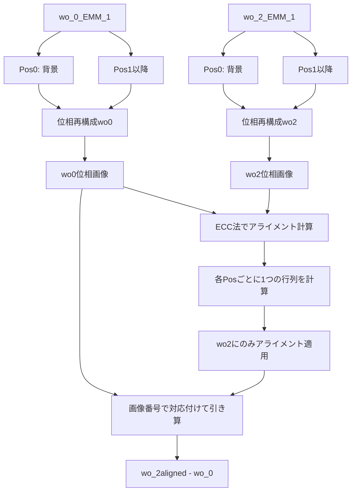

# 新フォルダ構造対応の位相画像処理システム

## 概要

`wo_0_EMM_1`と`wo_2_EMM_1`の2つのフォルダから位相再構成を行い、Pos単位でアライメントを計算し、対応する画像同士を引き算する処理を実装します。

## 処理フロー

## 処理の詳細

### 1. 位相再構成（新スクリプト: `batch_reconstruction_new.py`）

既存の[10_batch_reconstruction.py](c:\Users\QPI\Documents\QPI_omni\scripts\10_batch_reconstruction.py)を改造して作成します。**処理内容:**

- `wo_0_EMM_1`と`wo_2_EMM_1`の両方を処理
- 各フォルダ内のPos0を背景画像として使用
- Pos1以降の各フォルダから位相画像を生成
- 出力先: 各Posフォルダ内に`output_phase`フォルダ
- ファイル名: `img_000000000_Default_XXX_phase.tif`

**主な変更点:**

- ベースディレクトリを2つ（wo_0とwo_2）処理
- 各フォルダ内のPos0を背景として参照
- ファイル名が`img_000000000_Default_XXX.tif`形式に対応

### 2. アライメント計算（新スクリプト: `calc_alignment_new.py`）

既存の[21_calc_alignment.py](c:\Users\QPI\Documents\QPI_omni\scripts\21_calc_alignment.py)を改造して作成します。**処理内容:**

- **wo_0を基準**として、**wo_2をそれに合わせる**アライメント
- 各Posペア（wo_0/PosX ⇔ wo_2/PosX）ごとに処理
- **重要**: 各Posごとに1つのアライメント行列を計算
- 基準画像: `wo_0/PosX/output_phase/img_000000000_Default_000_phase.tif`
- ターゲット画像: `wo_2/PosX/output_phase/img_000000000_Default_000_phase.tif`
- ECC法でアライメント行列を計算
- そのアライメント行列をwo_2/PosX内の**全画像**（000, 001, 002...）に適用
- wo_0の画像はそのまま（基準なので変換しない）
- アライメント情報をJSON形式で保存
- 出力先: `wo_2_EMM_1/PosX/output_phase/alignment_transform.json`
- アライメント済みwo_2画像を保存
- 出力先: `wo_2_EMM_1/PosX/output_phase/aligned/`

**主な変更点:**

- wo_0とwo_2の**間**でアライメント（各フォルダ内ではない）
- Pos単位でアライメント計算（1つの行列を全画像に適用）
- wo_2のみ変換、wo_0はそのまま

### 3. 引き算処理（新スクリプト: `subtract_wo2_wo0.py`）

**処理内容:**

- アライメント済みwo_2画像と元のwo_0画像を使用
- 画像番号（末尾3桁: 000, 001, 002...）で対応付け
- `wo_2_EMM_1/PosX/output_phase/aligned/XXX` - `wo_0_EMM_1/PosX/output_phase/XXX`
- 対応するPos同士で引き算（Pos1同士、Pos2同士...）
- 結果をTIF形式で保存
- 出力先: `wo_2_EMM_1/PosX/output_phase/subtracted/`
- ファイル名: `img_000000000_Default_XXX_subtracted.tif`
- オプションでカラーマップPNG保存も可能

## 実装するスクリプト

1. **`batch_reconstruction_new.py`**: 位相再構成
2. **`calc_alignment_new.py`**: Pos単位でのアライメント計算・適用
3. **`subtract_wo2_wo0.py`**: 対応する画像同士の引き算

## 注意点

- Pos0は背景画像なので、位相再構成の対象外（背景として使用のみ）
- **アライメントはwo_0とwo_2の間で行う**（wo_0が基準、wo_2を合わせる）
- 同じPos内のwo_0とwo_2の画像は同じ時間に撮影されているため、**1つのアライメント行列**を使用
- アライメント計算は各Posごとに1回だけ（000番の画像ペアで計算）
- 画像の対応付けは末尾3桁の数字で行う（000, 001, 002...）