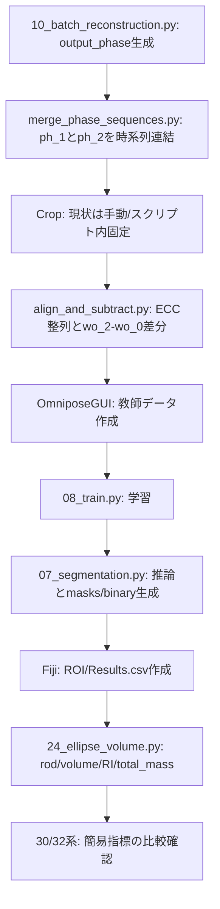

# 解析フロー整理プラン

## 目的

- 現行手順を「実行順」と「使用ファイル」で一本化する。
- `docs` と `scripts` の食い違いを明示し、迷わない実行ルートを作る。

## 主要な根拠ファイル

- パイプライン全体定義: [C:\Users\QPI\Documents\QPI_omni\PIPELINE.md](C:\Users\QPI\Documents\QPI_omni\PIPELINE.md)
- 位相再構成（batch）: [C:\Users\QPI\Documents\QPI_omni\scripts\10_batch_reconstruction.py](C:\Users\QPI\Documents\QPI_omni\scripts\10_batch_reconstruction.py)
- 連番マージ: [C:\Users\QPI\Documents\QPI_omni\scripts\merge_phase_sequences.py](C:\Users\QPI\Documents\QPI_omni\scripts\merge_phase_sequences.py)
- ECC+subtraction統合: [C:\Users\QPI\Documents\QPI_omni\scripts\align_and_subtract.py](C:\Users\QPI\Documents\QPI_omni\scripts\align_and_subtract.py)
- 学習: [C:\Users\QPI\Documents\QPI_omni\scripts\08_train.py](C:\Users\QPI\Documents\QPI_omni\scripts\08_train.py)
- 推論（現状混在あり）: [C:\Users\QPI\Documents\QPI_omni\scripts\07_segmentation.py](C:\Users\QPI\Documents\QPI_omni\scripts\07_segmentation.py)
- 体積・RI解析: [C:\Users\QPI\Documents\QPI_omni\scripts\24_ellipse_volume.py](C:\Users\QPI\Documents\QPI_omni\scripts\24_ellipse_volume.py)
- 簡易比較系: [C:\Users\QPI\Documents\QPI_omni\scripts\30_simple_mean_ri_analysis.py](C:\Users\QPI\Documents\QPI_omni\scripts\30_simple_mean_ri_analysis.py), [C:\Users\QPI\Documents\QPI_omni\scripts\32_simple_ellipse_ri.py](C:\Users\QPI\Documents\QPI_omni\scripts\32_simple_ellipse_ri.py)

## いま確定している実行フロー（暫定版）

## 整理方針

- 「主系統（運用で使う）」と「比較/検証/旧版」を2階層で分けて管理する。
- 主系統は1ステップ1スクリプトに固定し、代替手法は明示的に“比較用”へ移す。
- `07_segmentation.py` と `08_train.py` のような試行セル混在ファイルは、主系統ブロックを特定して運用手順で固定する。

## 成果物（この計画の次ターンで作るもの）

- 現行フローの実行手順（入力/出力/依存）を1枚にした運用メモ。
- 候補ファイル分類リスト（主系統・比較用・旧版候補）。
- ユーザー視点の最短実行コマンド列（毎回どこを触るか）。

