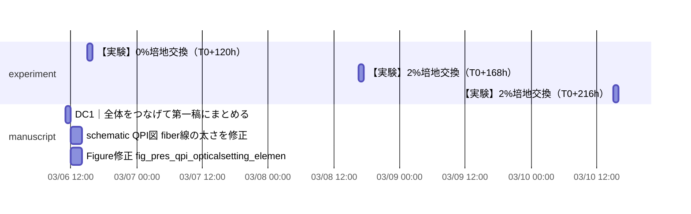

# ClickUp Schedule Dashboard
- range: 2026-03-06 -> 2026-04-09 (Asia/Tokyo)
- fetched: 608 / scheduled: 6 / unscheduled: 8
- overdue: 89 / due_soon_unscheduled: 0 / after_due: 0 / overlaps: 1

## Today's Calendar
- 11:00 - 12:00 [manuscript] DC1｜全体をつなげて第一稿にまとめる (86ewqyyyu)
- 12:00 - 14:00 [manuscript] schematic QPI図: fiber線の太さを修正 (86ewrcu8v)
- 12:00 - 14:00 [manuscript] Figure修正: fig_pres_qpi_opticalsetting_elements (86ewrdf40)
- 15:00 - 16:00 [experiment] 【実験】0%培地交換（T0+120h） (86ewr0z4d)

## Monthly Calendar
### 2026-03
| Mon | Tue | Wed | Thu | Fri | Sat | Sun |
|---|---|---|---|---|---|---|
|   |   |   |   |   |   | 1 ! |
| 2 ! | 3 ! | 4 ! | 5 ! | 6 (4) | 7 | 8 (1) |
| 9 | 10 (1) | 11 | 12 | 13 | 14 | 15 |
| 16 | 17 | 18 | 19 | 20 | 21 | 22 |
| 23 | 24 | 25 | 26 | 27 | 28 | 29 |
| 30 | 31 |   |   |   |   |   |

### 2026-04
| Mon | Tue | Wed | Thu | Fri | Sat | Sun |
|---|---|---|---|---|---|---|
|   |   | 1 | 2 | 3 | 4 | 5 |
| 6 | 7 | 8 | 9 | 10 | 11 | 12 |
| 13 | 14 | 15 | 16 | 17 | 18 | 19 |
| 20 | 21 | 22 | 23 | 24 | 25 | 26 |
| 27 | 28 | 29 | 30 |   |   |   |

## Gantt

## Overdue Tasks
- [code] 図の整理、管理方法、図の整理、管理方法、drive共有 due=2026-02-27 18:00 (86ewrd4h0)
- [code] 解析用PCに自動化を導入 due=2026-02-28 02:00 (86ewrayg7)
- [code] OpenAI API繝ｻGoogle API繧辰ursor縺ｮModels縺ｫ逋ｻ骭ｲ due=2026-02-27 11:00 (86ewr33ty)
- [code] 顕微鏡パソコンにnotion,clickup設定を入れる due=2026-02-27 23:00 (86ewr01gr)
- [code] 楕円近似をして長軸を取り出す due=2025-12-21 17:30 (86evxvt52)
- [code] グラフ出力用コードを書く due=2025-12-21 13:00 (86evtrypt)
- [experiment] 【実験】0.0055%培地交換（T0+96h） due=2026-03-05 17:30 (86ewr0z29)
- [experiment] 【実験】2%培地交換（T0+48h） due=2026-03-03 17:30 (86ewr0z00)
- [experiment] training datasetを作る due=2026-03-02 10:00 (86ewr09ev)
- [experiment] 細胞導入 due=2026-03-01 22:00 (86ewr092c)
- [experiment] Movingを確認 due=2026-02-28 18:30 (86ewr08x1)
- [experiment] 3条件のbgを取得 due=2026-03-01 19:30 (86ewr08e5)
- [experiment] bonding due=2026-02-27 14:00 (86ewr04gk)
- [experiment] ノイズ検証 due=2026-02-12 04:00 (86ewka1je)
- [experiment] Micromanager取り直し due=2026-01-29 04:00 (86ewca5rx)
- [experiment] 培地交換 due=2026-01-29 04:00 (86ewca5ad)
- [experiment] O/N culture due=2026-01-07 20:00 (86ew46bd3)
- [experiment] モルフォロジーフィルターを考える due=2026-01-22 15:30 (86evwckw7)
- [experiment] NH4Cl作成 due=2025-12-16 04:00 (86evwc619)
- [experiment] アドラボ片付け due=2026-01-08 21:30 (86evwc5pe)

## Overlap Warnings
- 2026-03-06 12:00 [manuscript] schematic QPI図: fiber線の太さを修正 overlaps [manuscript] Figure修正: fig_pres_qpi_opticalsetting_elements
