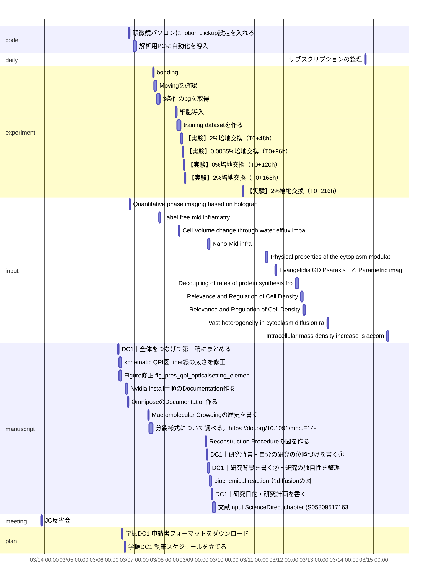

# ClickUp Schedule Dashboard
- range: 2026-03-01 -> 2026-03-31 (Asia/Tokyo)
- fetched: 649 / scheduled: 53 / unscheduled: 9
- overdue: 82 / due_soon_unscheduled: 0 / after_due: 0 / overlaps: 8

## Today's Calendar
- 10:00 - 11:00 [slide] Z-stack thickness mapを (86ew9k1x8)
- 11:00 - 12:00 [manuscript] DC1｜全体をつなげて第一稿にまとめる (86ewqyyyu)
- 12:00 - 14:00 [manuscript] schematic QPI図: fiber線の太さを修正 (86ewrcu8v)
- 12:00 - 14:00 [manuscript] Figure修正: fig_pres_qpi_opticalsetting_elements (86ewrdf40)
- 14:10 - 14:40 [plan] 学振DC1 申請書フォーマットをダウンロード (86ewqyvxc)
- 16:10 - 17:10 [plan] 学振DC1 執筆スケジュールを立てる (86ewqyvyh)
- 17:10 - 18:40 [manuscript] Nvidia install手順のDocumentation作る (86evw1b0f)
- 18:30 - 19:30 [slide] Vast heterogeneity in cytoplasmic diffusion rates revealed  (86evrf4dn)
- 18:40 - 19:40 [manuscript] OmniposeのDocumentation作る (86evw1au6)
- 19:40 - 20:40 [code] 顕微鏡パソコンにnotion,clickup設定を入れる (86ewr01gr)
- 20:00 - 21:00 [input] Quantitative phase imaging based on holography: trends and new perspectives (86evrehy8)
- 23:00 - 02:00 [code] 解析用PCに自動化を導入 (86ewrayg7)

## Monthly Calendar
### 2026-03
| Mon | Tue | Wed | Thu | Fri | Sat | Sun |
|---|---|---|---|---|---|---|
|   |   |   |   |   |   | 1 |
| 2 | 3 (1) ! | 4 | 5 | 6 (12) ! | 7 (10) | 8 (8) |
| 9 (8) | 10 (1) | 11 (2) | 12 (3) | 13 (2) | 14 (3) | 15 (3) |
| 16 | 17 | 18 | 19 | 20 | 21 | 22 |
| 23 | 24 | 25 | 26 | 27 | 28 | 29 |
| 30 | 31 |   |   |   |   |   |

## Gantt

## Overdue Tasks
- [code] 楕円近似をして長軸を取り出す due=2025-12-21 17:30 (86evxvt52)
- [code] グラフ出力用コードを書く due=2025-12-21 13:00 (86evtrypt)
- [daily] 開発環境を due=2026-01-24 04:00 (86ew9vej8)
- [daily] なぜこの小グループミーティングまでにやりたかったことをできなかったのかを振り返る。元気がなかったはできなかった以上のことを言っていない due=2026-02-05 19:00 (86ew9k6kh)
- [daily] Noteで修士一年の振り返りをする due=2026-02-03 00:00 (86ew9k60q)
- [daily] 春の庭 due=2026-01-07 23:00 (86ew465ec)
- [daily] M1 due=2025-12-21 22:30 (86evy8nam)
- [daily] 髪切る due=2025-12-21 18:00 (86evy8mne)
- [daily] フラフラして診察行かず... due=2025-12-17 14:30 (86evwv8rd)
- [daily] ショート動画ブロッカー入れる due=2025-12-18 04:00 (86evwrnj3)
- [daily] 日記タグ作り方 due=2025-12-25 04:00 (86evwr407)
- [daily] 徳井videoみる due=2026-01-23 23:00 (86evuufv2)
- [daily] 排水溝の髪の毛とる due=2025-12-13 00:00 (86evuue1a)
- [daily] youtubeの履歴見る due=2025-12-20 19:30 (86evuudtp)
- [daily] カトリック幼稚園ってどこだったのか due=2026-01-15 19:00 (86evufzrt)
- [daily] 机の上片付ける due=2025-12-09 23:00 (86evt9vy8)
- [experiment] ノイズ検証 due=2026-02-12 04:00 (86ewka1je)
- [experiment] Micromanager取り直し due=2026-01-29 04:00 (86ewca5rx)
- [experiment] 培地交換 due=2026-01-29 04:00 (86ewca5ad)
- [experiment] O/N culture due=2026-01-07 20:00 (86ew46bd3)

## Overlap Warnings
- 2026-03-06 12:00 [manuscript] schematic QPI図: fiber線の太さを修正 overlaps [manuscript] Figure修正: fig_pres_qpi_opticalsetting_elements
- 2026-03-06 17:10 [manuscript] Nvidia install手順のDocumentation作る overlaps [slide] Vast heterogeneity in cytoplasmic diffusion rates revealed 
- 2026-03-06 18:30 [slide] Vast heterogeneity in cytoplasmic diffusion rates revealed  overlaps [manuscript] OmniposeのDocumentation作る
- 2026-03-06 19:40 [code] 顕微鏡パソコンにnotion,clickup設定を入れる overlaps [input] Quantitative phase imaging based on holography: trends and new perspectives
- 2026-03-07 09:00 [slide] Mother Machine3Dの概念図 overlaps [plan] スマホにGoogleカレンダーのウィジェットを置く
- 2026-03-07 18:10 [experiment] 3条件のbgを取得 overlaps [input] Label free mid inframatry
- 2026-03-08 10:30 [experiment] training datasetを作る overlaps [input] Cell Volume change through water efflux impacts cell stiffness and stem cell fate
- 2026-03-09 11:00 [input]  Nano Mid infra overlaps [manuscript] DC1｜研究背景を書く②・研究の独自性を整理
